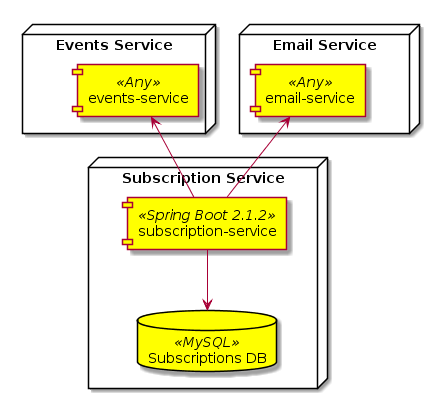
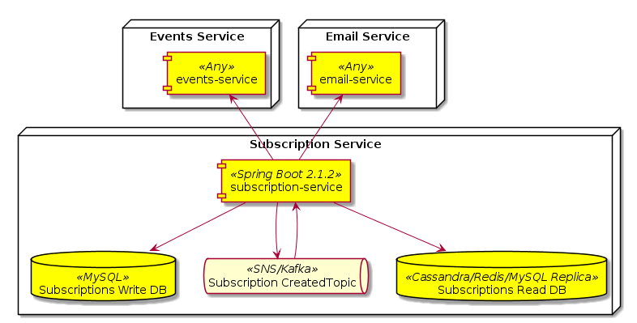

# Subscription Service

The application is developed using Spring Boot 2.1.2 together with Java 8.

For running the application is needed to have these technologies installed :

* Java 8
* Docker
* Gradle

To execute the application it's necessary to run the *run.sh* file.

More endpoints were added, completing the Subscriptions CRUD API.

To invoke them, it's necessary to pass the token in application.yml in the
Authentication header (without the Bearer word).

### Architecture

Here are the services that are part of the solution architecture :

  

A new architecture is proposed below which adds components to enhance scaling
 & performance in the solution :
 

  

When a new subscription is created, after saving in the write database, 
a message is published into the SubscriptionCreated topic. The subscription-service
is subscribed to that topic, so it consumes the created message and persists in
the read database. Each GET to /subscriptions will retrieve data from the read
database reducing the bottleneck when accessing the same database for read and 
write operations.

### Main libraries/frameworks used

The application was implemented by using some of the Spring Boot starter packages
including spring-boot-starter-web and spring-boot-starter-data-jpa.
In particular the starter web package adds a embedded Tomcat as the application
server, which could be changed by exluding the spring-boot-starter-tomcat from the
spring-boot-starter-web package, and adding the spring-boot-starter-jetty package
for Jetty or spring-boot-starter-undertow for Undertow.

Spring Data JPA was chosen for interacting with the database as it offers a lot
methods to perform database queries, without implementing anything.
In particular the SubscriptionRepository interface is in charge of this, which extends
the JpaRepository interface. It's also possible to add specific queries, as it
can be seen in the SubscriptionRepository by adding the @Query annotation and
specifying the JPA Query. No implementation is needed for this, which also makes
it easier for develop a Rest API.

MySQL was chosen as the RDBMS because of its easy configuration and its remarkable
performance.

For the security access JWT was chosen, because of its huge amount of libraries
and the fact that it is a security standard in the industry nowadays.

### API Documentation

The subscription service is documented using Swagger 2. It's possible to see
 the documentation in the *${URL}/swagger-ui.html endpoint*.
 
### CI/CD Pipeline

There should be 3 environments for deploying the services in the cloud :

* Development : For deploying features that are being tested as they are finished
* Staging : For deploying finished features to test in almost identical state as production
* Production : For deploying all the finished features that are released for use in production

For this, Jenkins would be the CI/CD application for deploying to those environments.

Each environment build and run configuration in Jenkins would need to be attached
to a git branch, so when new changes are pushed to the remote repository automatic build
can be executed, and if it's configured automatic deployment (not recommended for production).

As the architecture is deployed using Docker, perhaps Jenkins should deploy the
applications as Docker containers in AWS ECS (Elastic Container Service) setting
up the ELBs correctly so the services can scale according to the load they handle.

### Future additions

Unit and functional tests must be added to the service in the future as well as
configuration for deploying the services on the cloud using Kubernetes.

In the security part of the subscription service, a fixed JWT read from the
configuration file which is not desirable. In the future a authentication server should be
provided which will be in charge of the JWT management.

There are two strategies for validating the tokens in the future : 

* Validating the token using a Http Request against the authentication server
* Verify the token locally on each service by using the public key stored in a Vault
server accessible from all the services using a public RSA key.

It's preferable to use the second strategy as it avoids a request against the
authentication server which also would probably need to retrieve the user data from
the database and generate a JWT based on that data.
